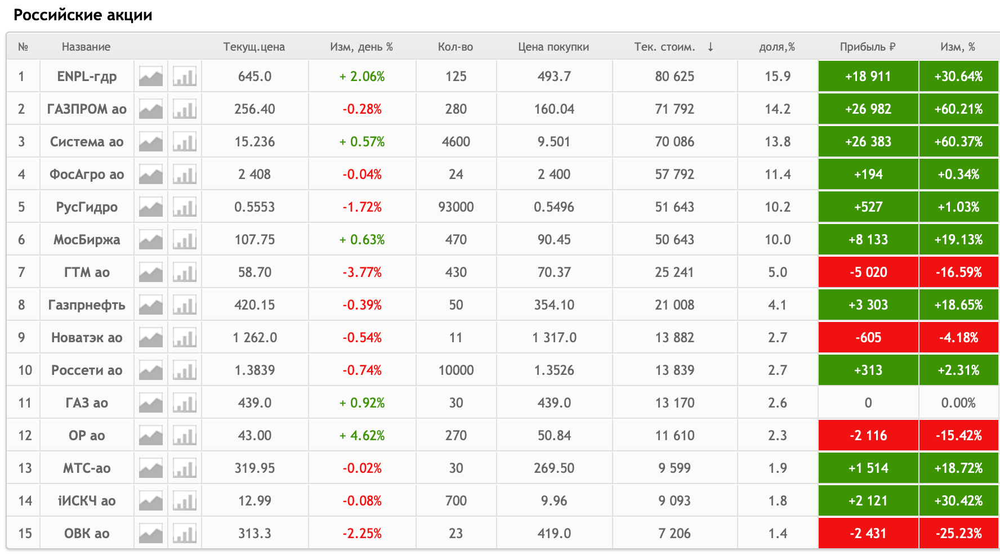
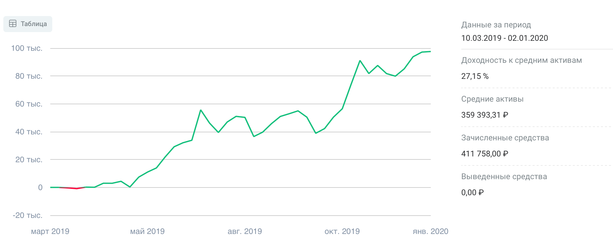

# Инвестиции в 2019 году

Подвожу итоги инвестиций в 2019 году.

Год получился удачным. В принципе было сложно покупать активы которые на росли. Так и мой портфель вырос вместе с рынком.

За год индекс Московской биржи вырос на 28,55%. Наш рынок показал уже второй год подряд одну из самых лучших по доходности стран в мире. Инфляция снизилась на 1,25 п.п. и составила 6,25%. Так же снизились и ставки по депозитам в банках. В связи с этими факторами наш фондовый рынок испытывает рекордные притоки частных инвесторов. Так в августе был зарегистрирован 1 млн. ИИС, а уже в декабре новый рекорд в 1,5 млн. новых ИИС.

Такой рост клиентов так же помог нашему рынку держать высокие позиции в рейтинге доходности. Что радует – объёмы операций тоже выросли, то есть это не пустой рост. На рынок пришли деньги из депозитов за доходностью.

## Результаты за 2019 год

Портфель и осознание того, как мне нравится инвестировать на фондовом рынке претерпели значительные изменения. Если в 2018 году я изучал рынок и покупал всё, что понравится, то в 2019 я уже работал со своим портфелем, отбирая лучшие акции. Акции которые мне нравятся и которые я понимаю.

После первого года инвестиций хотел делать фокус на 6 акциях, так и сделал. После чего портфель уже более 5 месяцев никак не меняется по составу. Это мне даёт больший контроль и понимание того что находится в портфеле. Я хорошо знаком с акциями и могу рассказать зачем они в портфеле.

Понравилось, что в марте говорил, что нужно покупать «Газпром» и сам его купил по 150₽, купил много так как он был в приоритете покупок – как раз в то время начал формироваться подход на фокус в нескольких акциях.

Так же покупал «АФК Систему» по 9₽, так же много, входит с мой фокус акций, основываясь на том, что Система всё-таки выплатит по итогам 2019 дивиденды по дивидендной политике. И мы уже знаем заявления правления, что это возможно.

Постепенно портфель с 40 позиций в начале 2019 дошёл до 15 позиций в конце 2019. Формировались крупные позиции в 6 акциях, которые в итоге занимают более 70% веса портфеля.

### Состав портфеля

К рынку стал относиться очень спокойно. Для каждой бумаги в портфеле в принципе определил цены по которым буду покупать этих эмитентов.

> Полностью избавился от спекулятивных сделок.

В марте же перекладывался из обычного брокерского счёта в ИИС. Результаты буду показывать для ИИС и для общего счёта с начала инвестиций.

Для открытого в марте ИИС год выдался очень успешным, вырос месте с рынком даже немного лучше, учитывая то что пополнения делались каждый месяц, что немного снижает доходность и на прямую сравнивать с индексом было бы не правильно.

Динамика.

В основном видно что было два крупных пополнения в конце марта – перевёл деньги с брокерского счёта на ИИС, и в конце мая – пополнения за счёт премии.

На графике доходности видно два «скачка»:
* май-июль – рост за счёт переоценки «Газпрома»
* октябрь-ноябрь за счёт новостей и байбека «АФК Системы» и переоценки акций «Эн Плюс»

Все эти акции входят в топ 6 акций портфеля и в топ 3 акций на которые я делал ставки в этом или следующем году.

> Конечно, моё мнение было подкреплено экспертами рынка, в основном это частные инвесторы, а не представители брокерских контор.

Коротко итог по вложенным средствам и полученную оценку активов.

> Итого: на зачисленные 411758₽ получилась переоценка портфеля в 507430₽. Дельта 23%

### Полученные дивиденды

В 2019 дивидендами пришло более 15000₽ или около 4% доходности на вложенные средства. В следующем году если ничего менять не буду ожидаю более 25000₽ дивидендами, или 6% на вложенные средства.

Самые большие дивиденды, по абсолютам, получил от компании «Газпром» и «Русгидро». Дивиденды конечно же сразу реинвестировались.

На счёт низкой дивидендной доходности – у меня не дивидендный портфель, а портфель раскрытия стоимости. Дивиденды мне нужны будут лет через десять.

## Итоги

Если 2019 год выше супер прибыльным то в 2018 году прибыль была около ноля. В принципе так же как и индекс на наш рынок. Средняя доходность за два года в годовых составляет 14%. Это близко к моему ключевому значению в 15% годовых. А дельта прибыли составила 23%.

На графике отчётливо видно что 2018 год прибыли практически не принёс в отличии от 2019 года. Примерно так же двигался и индекс.

Самым удачным моментом для новых покупок можно считать август и сентябрь. В эти месяцы рынок был в значительной просадке и можно было купить акции в портфель по более низкой цене. Но у меня на тот момент не было денег.

> В начале года получу первый вычет по ИИС в размере 52000₽. Это сразу же даст доходность в 21% годовых и дельта увеличится до 34%!

Год считаю успешным. Сформировал инвестиционную стратегию и далее буду её придерживаться.

## Чем буду заниматься

Конечно же продолжу инвестировать. ИИС должен прожить ещё как минимум два года. В 2020 пополню счёт ещё на 400000₽.

Стратегию пока менять не собираюсь. Мне нравится тот подход который сформировался у меня за последние два года.

В этом году постараюсь поездить на собрания акционеров, хочу быть ближе к компаниям в которые отнёс свои деньги. Хочу понимать немного больше главных акционеров и совет директоров, который принимает важные решения в компаниях.

## Ссылки

[Тред в Твиттере](https://twitter.com/voischev/status/1212059337025368064)
