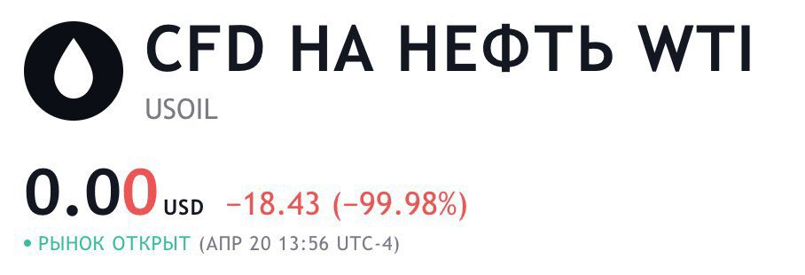
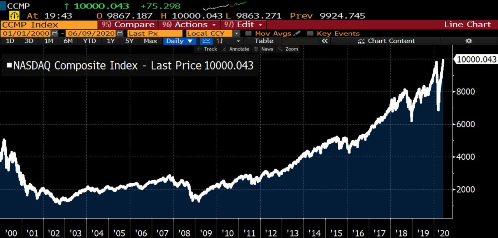
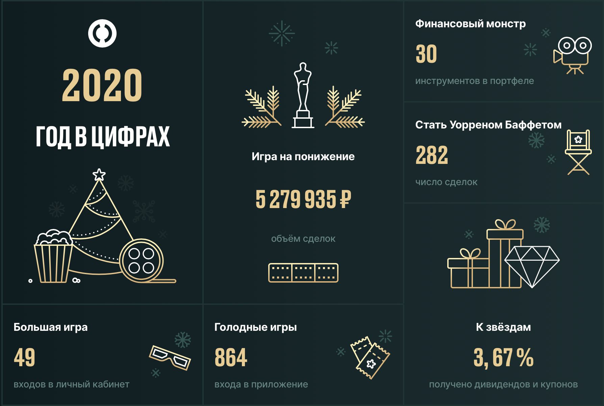
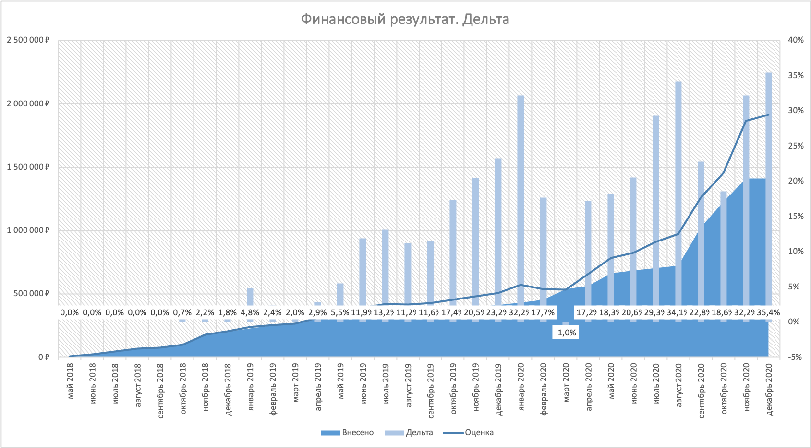
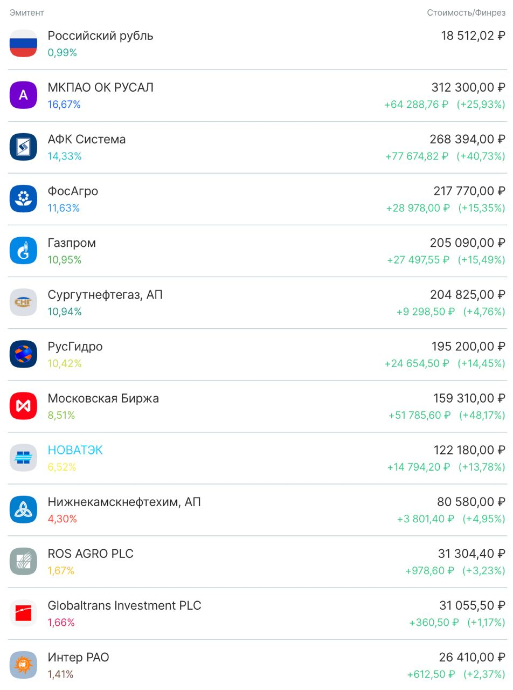
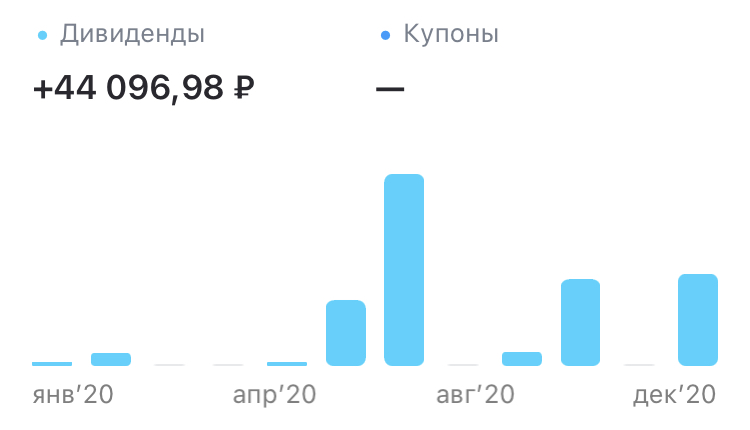

# Инвестиции в 2020 году

Итоги инвестиций в 2020 году.

Никто не ожидал такой год. Этот год научил плохому новичков на фондовом рынке показав быстрое восстановление после мощного падения. Люди с 15-25 летним стажем говорили, что не видели ничего подобного ранее и не знают что будет.

Количество розничных инвесторов продолжило расти и к концу года достигло более 8 млн счётов.

В марте удачно получил инвестиционный вычет с ИИС в 52000₽ и сразу же вложил в рынок покупая сильно просевшие акции. Дно конечно поймать не смог, был в нескольких процентах от самого дна 16-го марта.

> Лучшая защита от убытка — накопленная прибыль

Теперь очень понимаю это высказывание, после пережитых убытков в марте которые обнулили всю 20% накопленную прибыль портфеля.

С середины марта начал работать удалённо, удалённо работаю и сейчас, не понятно сколько ещё будет такой режим. Для мира это тоже было своеобразным испытанием, давшее некоторым компаниям стимулы в развитии. У других выпали возможные доходы на несколько лет вперёд. Как гласят нам китайские иероглифы по отдельности в слове «кризис»:

> Кризис — это опасность и благоприятная возможность

В апреле мы увидели отрицательные цены на нефть, очень сложно было такое представить. Баррель нефти стоил -38 долларов.

В мае вся прибыль портфеля восстановилась. Рынки показали V-образное восстановление в индексе SP500, а индекс NASDAQ преодолел отметку в 10000 пунктов. Впервые в истории. Тоже достаточно неожиданное событие.

С лета и практически до конце года не было значимых событий для меня, я отдыхал и просто покупал акции из портфеля на ежемесячные пополнения.

Событие которое можно выделить, это выборы президента США. Я немного подготовился и накопил кеш для возможной покупки на падении рынка. Так случилось, что ещё до выборов, цены на акции стали очень привлекательны и я не удержался и покупал акции. Эти покупки можно назвать самыми успешными в 2020 году.

К концу года сформировал ещё несколько портфелей, о двух из них хотелось бы написать. Первый портфель «портфель на кешбэк», второй «детский портфель». Думаю из названий понятна суть портфелей. Немного подробностей:
* на ежемесячный кешбэк я буду покупать рисковые активы на российском рынке с малой ликвидностью, подбор акций такой, что бы оправдать риск-доходность;
* детский портфель пополняется ежемесячно на 3000₽ в отраслевые ETF на биотехнологии и информационные технологии, портфель на срок около 20 лет.

## Результат

Сначала хочется показать какой красивый отчёт сделал мой брокер. Количество заходов в приложение действительно большое, хочется с этим бороться, потому что я просто смотрю на портфель и думаю. Много думать тоже плохо, когда есть понятная и скучная стратегия, это может привести к лишним действиям с портфелем.

### Бенчмарки

> Как веду бенчмарки — это покупки, в последнюю пятницу каждого месяца ETF полной доходности в рублях на индексы SP500 и IMOEX, на суммы равные пополнению портфеля в этом месяце.

**Дельты:**
* `SP500_synt` 27%
* `IMOEX_synt` 25%

**Инфляция:** 4,9%

### Сравнение накопленной дельты по месяцам

| Дельта %  | 01 | 02 | 03 | 04 | 05 | 06 | 07 | 08 | 09 | 10 | 11 | 12 |
|-----------|----|----|----|----|----|----|----|----|----|----|----|----|
| SP500_b	| -- | -- | -- | -- | -- | -- | 25 | 36 | 24 | 22 | 26 | 26 |
| IMOEX_b	| 28 | 14 |  0 | 10 | 12 | 12 | -- | 21 | 16 |  5 | 20 | 24 |
| Портфель	| 32 | 17 | -1 | 17 | 18 | 20 | 29 | 34 | 22 | 18 | 32 | 35 |

### Портфель

* **Дельта:** 35% 🎉
* **Годовых:** 32%

> Портфель показывает дельту прибыли лучше ленивых инвестиций в индексы, по этому эксперимент активного управления портфелем я продолжаю.

**Лучшая продажа по процентам:** 200+% распродал остатки акций «Института Стволовых Клеток Человека» на росте на новостях о вакцине от COVID-19

**Лучшая продажа по абсолютам:** 111% акции «АФК Система», продал половину пакета по 32₽ в надежде откупить обратно ниже, что и сделал, получил дополнительный 1% доходности за активные действия.

Худших продаж не было. Все сделки, даже с отрицательным финансовым результатом, были со знаком плюс.

«Эн Плюс» поменял на «Русал» при соотношении `ENPL/RUAL > 20`

За год топ 70% портфеля не поменялось по составу.

> Капитал прирос за год в 2,7 раза за счёт новых пополнений и курсовой переоценки.

В последнем месяце года я производил оптимизацию налогов продав убыточные позиции и откупив пакет акций снова. Некоторые акции ушли из моего основного портфеля, или переместились в «портфель на кешбэк», там им и место, из-за недостаточной ликвидности.

**Издержки:** 4648₽, или 0,5% от внесённых в этом году средств. Это адекватно больше чем в прошлом году. Операций по счёту было больше и на большие суммы.

### Дивиденды

**Дивидендов получено от вложенных средств:** 3,1%

Вообще 2020 год был сложный по поводу прогнозирования возможных дивидендов, в связи с пандемией некоторые копании отменили дивиденды, а некоторые задержали выплаты.
Несмотря на это портфелем было получено больше дивидендов чем ожидал в начале 2020 года. Сюрпризы преподнесли «Фосагро» и «Система», если первые заплатили значительно больше, то вторые так и не выплатили ожидаемые 1,19₽ на акцию. Не устану повторять что мой портфель пока не держит в фокусе дивидендные выплаты, меня интересует общая прибыль от переоценки активов.

## Итоги

Доволен, что как и писал в отчёте за прошлый год, я не поменял стратегию. Портфель остался в сущности таким же, идеи сохранили актуальность и ещё ждут полного раскрытия. Эти идеи позволили быть не хуже рынка, даже не имея золота в портфеле которое дало кратный прирост в 2020 году.

Хочу добавить две позиции в долгосрочные идеи, это акции сельскохозяйственного и нефтехимического сектора. Буду набирать акции нефтяного сектора до 35% и более. Очень много прогнозов, с которыми я согласен, что цена на товары будут расти.

В этом году продолжу получать инвестиционный вычет с ИИС в 52000₽. Ещё попробую получить социальный вычет за лекарства. В прошлом году я получил вычет за покупку недвижимости, что принесло почти 10% от заработанной платы. Нужно пользоваться возможностями предоставляемые правительством. Хочется похвалить налоговую за подобные вычеты, они дают значимую прибавку к капиталу.
Денег становится больше, больше знаний и уверенности. Надеюсь это состояние удастся сохранить до выполнения своих целей.

Думаю этот кризис ещё не закончился и он даст нам ещё **благоприятные возможности** двигаться с большей скоростью к горизонтам инвестирования.

Что быть на чеку — нужно всегда помнить:

> *Жизненный цикл праздничной индейки:*
«Уверенность индейки в безопасности достигает максимума, когда риск – самый высокий». `Насим Талеб`

## Ссылки

* [Тред в Твиттере](https://twitter.com/voischev/status/1224736030802305025)
* [Лекция про риск-менеджмент портфеля](https://youtu.be/aJJ5DEWGvk0)
* [Официальная инфляция](https://cbr.ru/DKP/)
