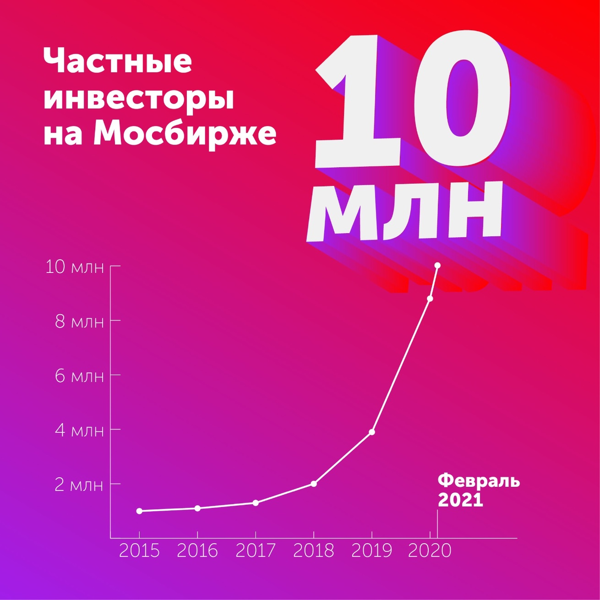

# Инвестиции в 2021 году

Итоги инвестиций в 2021 году.

> Заметка находится в работе.

В этот раз решил что писать мысли на каждое пополнение, или покупку каждый месяц достаточно интересно для будущего анализа действий.

## Заметки по месяцам

Сравниваюсь с синтетическим бенчмарком в виде покупок ETF на SP500 и IMOEX, суммами равными пополнениям моего портфели.

> Как веду бенчмарки — это покупки, в последнюю пятницу каждого месяца ETF полной доходности в рублях на индексы SP500 и IMOEX, на суммы равные пополнению портфеля в этом месяце.

| Дельта %  | 01 | 02 | 03 | 04 | 05 | 06 | 07 | 08 | 09 | 10 | 11 | 12 |
|-----------|----|----|----|----|----|----|----|----|----|----|----|----|
| SP500_b	| 30 | 29 |    |    |    |    |    |    |    |    |    |    |
| IMOEX_b	| 26 | 26 |    |    |    |    |    |    |    |    |    |    |
| Портфель	| 38 | 44 |    |    |    |    |    |    |    |    |    |    |

### Январь
Московская биржа отчиталась об открытии новых ИИС в 2020 году.

Перевёл свои брокерские счёта на новые выгодные тарифы без минимальных платежей. [Открытие брокер](https://open-broker.ru/invest/tariffs/) снова стал одним из самых выгодных.

Реальная доходность активов в рублях с учётом инфляции за 1995-2020, последние 15 лет и последние 10 лет.

Рыночная и балансовая стоимость Tesla обогнала капитализацию всех автопроизводителей.

### Февраль

Японский Nikkei 225 достиг максимума за 30 лет!

Советую всем найти время и посмотреть все [эти длинные лекции](https://t.me/arsageranews/379) от УК Арсагера. Это наверное самая полная информация про фондовый рынок и психологию инвестиций в доступном формате.

По отчётам Центрального Банка российские акции занимают большую долю вложения населения по объёмам. Новые инвесторы конечно скорее вкладываются в иностранные акции. По распределению кажется всё правильно — иностранная валюта должна занимать примерно 15-30%, в зависимости от трат по валютам. Просто интересное совпадение.

Капитализация мировых рынков акций. Доля американских компаний в стоимости мирового рынка акций составляет около 46%. 10 лет назад она была на уровне 33%.

Всего лишь 30 млн. рублей и вы в 1% богатейших людей России.

[Московская биржа отчиталась](https://www.moex.com/n32746/?nt=106) о 10 млн. частных инвесторов.

Распродал позицию Фосагро. Цены акций продемонстрировали значимый рост, который я ожидал только к концу года. Пришло время забрать доходность и переложить в позиции в которых есть больший потенциал раскрытия стоимости. Несмотря на отличные дивиденды ожидаемая доходность стала ниже других акций в моём портфеле. 10% от портфеля Фосагро были набраны со средней 2600₽, распродал на 3700₽ после чего акции показали 4040₽, взлёт цены на удобрения. Начал набирать позицию Полиметалла, думаю до 3% от портфеля хватит. Акций из защитного сектора в портфеле осталось совсем мало, нужно это исправить.
