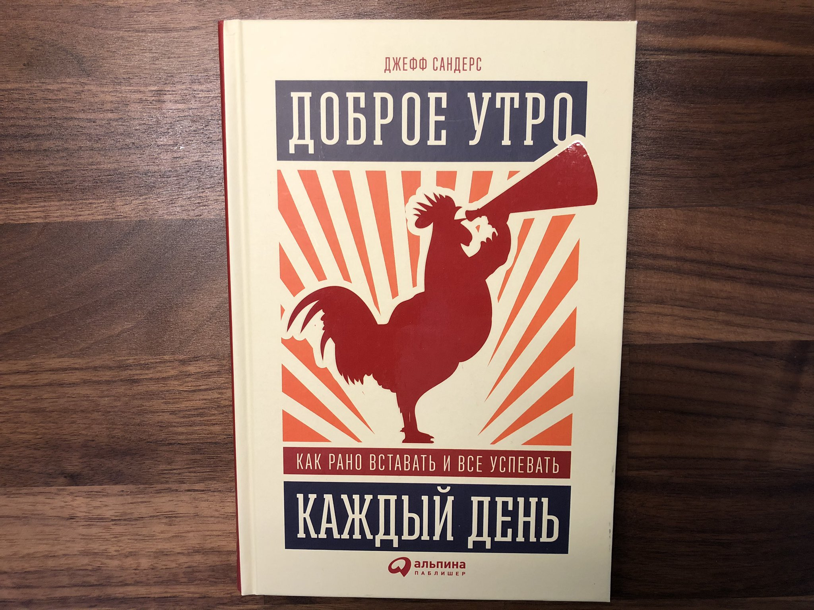
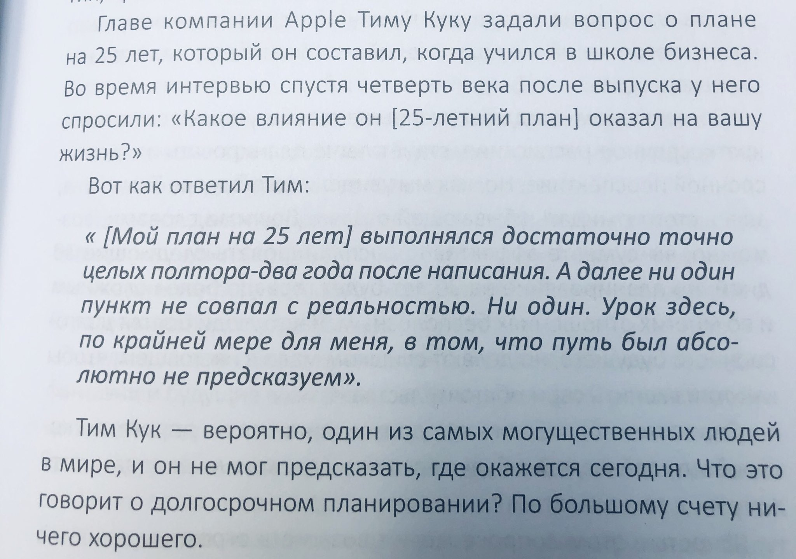

# Доброе утро каждый день. Как рано вставать и всё успевать

В книге описаны практические примеры для, того что бы достигать поставленные цели и эффективно работать над задачами.

Самоизоляция и работа из дома самое подходящее время для этой книги.
Начал читать в книгу в дни самоизоляции из-за пандемии COVID-19. Работа из дома сильно поменяла прежние привычки и мне хотелось это время использовать максимально эффективно.

Как обычно, ниже выписываю интересные для меня мысли.

> «Победите свой день ещё до завтрака»

Это про хорошо поработать утром над важными задачами, оставив остаток дня что бы освободить голову, отдохнуть и сократить стресс.

> Простые повседневные привычки — это основа, которая помогает добиться великих целей

Автор «простой человек который любит списки и доводить дела до конца».

> Комфорт враг великих целей. Комфорт вызывает привыкание. Комфорт главный отвлекающий фактор современности. Комфорт не способствует росту

Очень с этим согласен, сознательно пытаюсь не создавать много комфорта вокруг себя, это мотивирует пытаться делать что-то лучше.

По этому для себя запишу следующее:

> Выбирай то, что требует чуть больше усилий. Научись испытывать от этого процесса удовольствие. Сделай привычкой

Раз книга про «утро», нашёл картинку с совами. Можно подписать «Уже 6 утра, вставайте!». Это в тему про то, что «совы» и «жаворонки» появились примерно с появлением электричества. У нас в доме вечером приглушён свет. Для меня сегодня нет трудности проснуться в 6:00.

> Вступи в «эксклюзивный клуб высокопродуктивных людей»: Говард Шульц (Starbucks), Ричард Брэнсон (Virgin Group), Анна Винтур (Vogue), Тим Кук (Apple) — встают промежутке от 4:30 до 5:45

> Каждую ночь я засиживаюсь допоздна и каждое утро понимаю, что это была плохая идея

Нужно установить время для завершения работы. Это граница между работающим «я» и уставшим «я». Автор завершает работать в 20:00 и выключает все устройства. Задачи либо закончил, либо перенёс на следующий день. План на утро сформирован. Перед сном читает книгу. Уже продолжительное время я пытаюсь не использовать компьютер поздно вечером, это реально помогает разгрузить мозг перед сном.

> Составьте список вещей, которыми вы регулярно занимаетесь поздно вечером. Какие из них можно перенести, сократить или вообще прекратить?

Это про то, как не занимать мозг перед сном. Мозг должен подготовиться ко сну. Захотел спать — иди в кровать.

> Постоянно рано вставать — навык. Значит его можно развивать и видеть прогресс

Люблю навыки. Они превращаются в мастерство в определённый момент.

> Для лучшего сна — лучше не нагружать себя заботой о переваривании пищи

Ну это кажется и ежу понятно.

> На утро нужен план действий. Иначе о продуктивности и желании вставать из кровати — можно забыть. План на утро можно придумать вечером

Это очень помогает дать эффективный старт рабочему дню.

> Даже 1 час в день в течении недели может оказаться достаточным чтобы продвинуться в важных для вас вещах. Повторяйте его регулярно и охраняйте это время как сокровища

Предложение: в рабочем календаре отметить «завершение рабочего дня», что бы никто не смог назначить вам встречу и заставить жить по чужому распорядку дня. А ещё я отмечаю в календаре этот самый 1 час на нужное мне дело, возможно которое я не хочу делать несколько часов подряд, или оно приносит только удовольствие, но мало профита и всё равно мне хочется этим заняться.

> Забудьте о планах на год

У меня уже ряд лет есть только «направления на год» в которых хочется двигаться. Долгосрочные планы не работают. И какое удовольствие двигаться по плану целый год? Если можно мелкие задачи закрывать за день-месяц и получать столько же удовольствия?

Автор предлагает подробно расписывать планы, максимум, на квартал. Это тот срок, который можно с большой вероятностью выполнить без каких либо «но».

По мимо планов на квартал предлагает делать детализацию на каждый день, неделю в календаре. Что бы выработались привычки. Их нужно охранять.  Важное делать в начале дня, не важное во второй половине дня. Так проще мотивировать встать утром и больше сил для важного.

> «Ноль входящих», «Ноль проектов», «Нулевая база» — это все про идеальные точки для завершения отрезков работы, завершения рабочего дня, или подготовка ко сну

Целая глава отведена отчётности и самоконтролю. Дневные, недельные, месячные, квартальные и годовые отчётности помогают двигаться к целям. Я давно в календаре создал повторяющиеся события с анализом недели. Подвожу годовой итог. Хочу добавить цели на день и «стендап».

> «Выделите время что бы подумать»

Нужно задавать себе вопросы которые хочется решать, что бы двигаться по задачам и целям. Часто я просто начинаю задачу придумывая на ходу. Кроме техники [Pomodoro](https://voischev.ru/t/pomodoro) где есть время думать. Хочу выделить 15 мин. каждый день.

> Музыка для того что бы сосредоточиться [focusatwill.com](https://focusatwill.com)

На уровне профи автор предлагает попробовать стол для работы стоя. Я попробовал, это правда работает, больше концентрации, и лучше думается. И доску для визуализаций, что бы не держать в голове много схем, пунктов, задач.

<blockquote class="twitter-tweet" data-dnt="true" data-theme="light">
Нашёл конфигурацию для работы за ноутбуком стоя <a href="https://t.co/Go01b8JDpl">pic.twitter.com/Go01b8JDpl</a>
&mdash; Ваня Воищев (@voischev) <a href="https://twitter.com/voischev/status/1245967046334185473?ref_src=twsrc%5Etfw">April 3, 2020</a></blockquote> 

В этой книге мне был интересен опыт другого человека. Отметил для себя несколько вещей:

* каждый день важен
* планирование, контроль и аналитика
* фокус на целях
* выделять время каждый день что бы думать

Выдержка самого важного:

* Планируйте: составляйте целенаправленный план до начала каждого дня.
* Выполняйте: добивайтесь ощутимого прогресса на пути к главным целям, посвящая им специально выделенные блоки времени.
* Контролируйте: каждую неделю подводите итоги всего сделанного и думайте, что будете делать дальше.

Планируйте, выполняйте и подводите итоги. Вот и всё.

## Ссылки

* [Тред в Твиттере](https://twitter.com/voischev/status/1252132750888505345)
