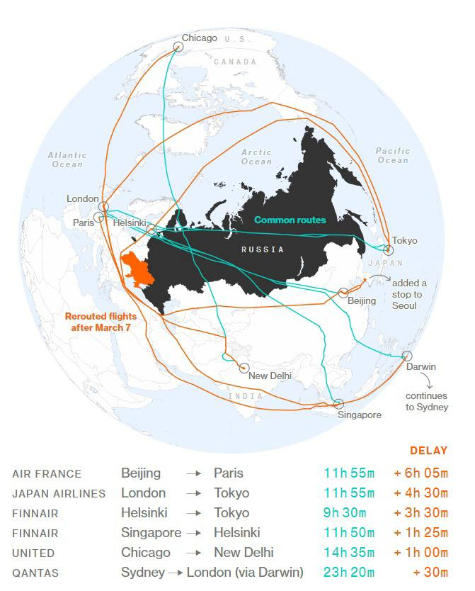
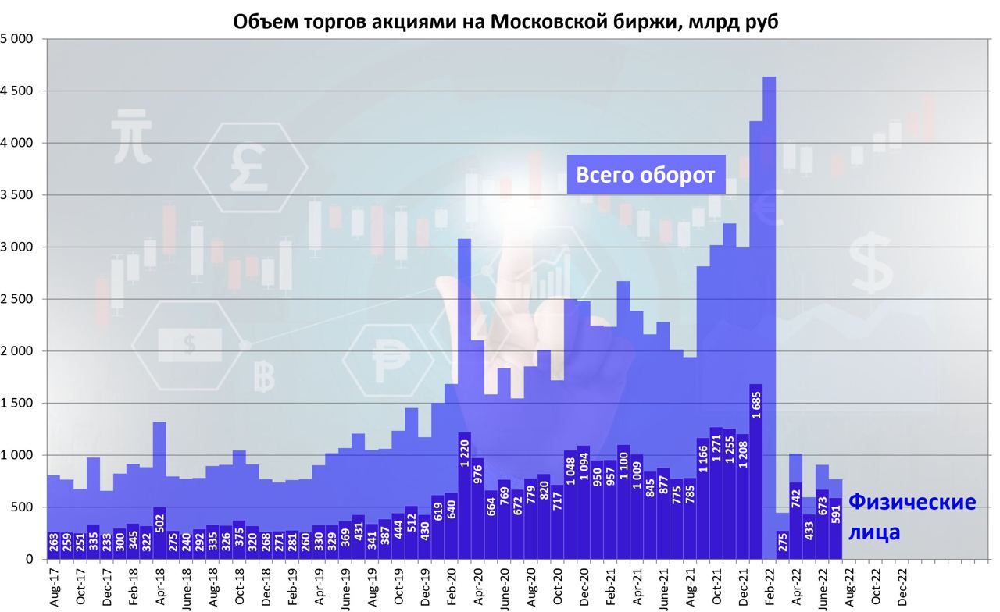

# Инвестиции в 2022 году

Итоги инвестиций в 2022 году.

Продолжу писать заметки каждый месяц. В прошлом году это получилось интересно.

## Заметки по месяцам

Сравниваюсь с синтетическим бенчмарком в виде покупок ETF на SP500 и IMOEX, суммами равными пополнениям моего портфели.

> Как веду бенчмарки — это покупки, в последнюю пятницу каждого месяца ETF полной доходности в рублях на индексы SP500 и IMOEX, на суммы равные пополнению портфеля в этом месяце.

| Дельта %  | 01 | 02 | 03 | 04 | 05 | 06 | 07 | 08 | 09 | 10 | 11 | 12 |
|-----------|----|----|----|----|----|----|----|----|----|----|----|----|
| SP500_b	| 29 | 21 | -- | -- | -- | -- | -- | -- | -- | -- | -- | -- |
| IMOEX_b	| 18 | -4 | -- | -- | -- | -- | -- | -- | -- | -- | -- | -- |
| Инфляция	| 16 | 18 | 26 | 29 | 29 | 28 | 28 | 28 | 28 | 28 | 28 | 28 |
| Портфель	| 41 | -3 | 22 | 6  | -2 | 1  | -1 | 12 | -5 | 9  | 5  | 7  |
| Над инф.	| 25 | -21| -4 |-23 |-31 |-27 |-29 |-16 |-33 |-19 |-23 |-21 |

### Январь

Не смотря на высокие цены на нефть, Российский рынок показал одно из худших падений в истории.

### Февраль

Признание Россией ДНР и ЛНР, военное восстановление территорий республик и распродажи на Российском фондовом рынке. Большинство инвесторов в Российский рынок потеряли более 25% капитала.

### Март

Банк России принял решение повысить ключевую ставку до 20% годовых.

[Компании объявившие об уходе из России (список)](https://www.sravni.ru/novost/2022/3/29/opublikovan-spisok-inostrannyh-kompanij-kotorye-ushli-iz-rossii/).
Удачи этим компании в новом мире. Моё доверие и лояльность к ним потеряно. Уже купил телефон Huawei, удалил браузер Firefox, закрыл Instagram. Ищу видео не из источников YouTube. Задумался об уходе из GitHub. А Adidas заменил на Anta Sports и Li-Ning.

Несколько знакомых из моего окружения выехали из РФ в Турцию и Казахстан. В экономическом плане не вижу смысла выезжать, особенно в Евро Союз.

> Сравнивать доходность моих инвестиций с ETF на SP500 и IMOEX не представляю возможным по прежней схеме. Решил что буду сравнивать доходность с инфляцией.

### Апрель

Банк России дважды понизил ключевую ставку до 14%.

Цены на пшеницу и масло на максимумах.

Почти 90% вкладов вернулись в банки.

> Для себя сделал вывод что деньги, это тоже позиция в портфеле

### Май

ФРС США повысила ключевую ставку на 0,5%.

Драматичный график акций Virgin Galactic. Для меня ознаменует конец безумных инвестиций.

Значимость российского экспорта в мире.

Отличие девальваций/укреплений рубля по годам.

Банк России дважды понизил ключевую ставку до 11%.

### Июнь

### Июль

### Август

### Сентябрь

Ничего не происходило.

### Октябрь

Генерал Армагеддон Суровикин в деле.

### Ноябрь

40% Дивидендов Газпрома частные инвесторы оставили в рынке.

### Декабрь

Изменил стратегию инвестирования. Теперь 50% инвестиций будут только в компании с критериями:
- могу потрогать и использую в своей стране
- без этого не представляю жизнь

А 50% пойдёт в управляющую компанию. Там будут активно управлять портфелем. А мои 50% скорее для удовольствия от инвестирования.
