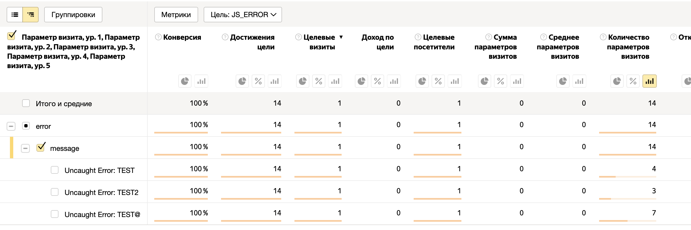

# Мониторинг ошибок сайта средствами Яндекс Метрики.

Я не нашёл хорошего бесплатного решения для мониторинга ошибок сайта. Небольшая хитрость, или возможность Яндекс Метрики позволяет организовать мониторинг ошибок вместе с другими метриками сайта.

Для работы требуется подключённая Яндекс Метрика на сайте.

## Создать цель "JavaScript-событие"

Задал идентификатор события как `JS_ERROR`. Можно назвать любым удобным именем. Это событие будет использовано для отправки параметров ошибок пользователя.


## Функция отправки события с ошибкой

Небольшая тонкость для отправки пользовательского события ошибки лучше положить отдельным ключом, для удобства отображения в Яндекс Метрике. В параметрах визита можно прокинуть дополнительные данные о пользователе.

```
function logError(error) {¬
    const data = {
        message: error.message,
        stack: error.stack
    };
    ym(YM_ID, 'reachGoal', 'JS_ERROR', { error: data });
}
```

Подписываемся на все ошибки страницы и отправляем ошибки в Яндекс Метрику.

```
window.addEventListener('error', logError);
```

## Настроить отчёт мониторинга

Группировка по параметрам пользователя. Выбрать `error` и `message`, получаем отчёт с ошибками на сайте. Можно настроить ежедневную рассылку отчёта на e-mail, или даже настроить оповещения.




## Ссылки

* [Справка метода `reachGoal` Яндекс Метрики](https://yandex.ru/support/metrica/objects/reachgoal.html)
