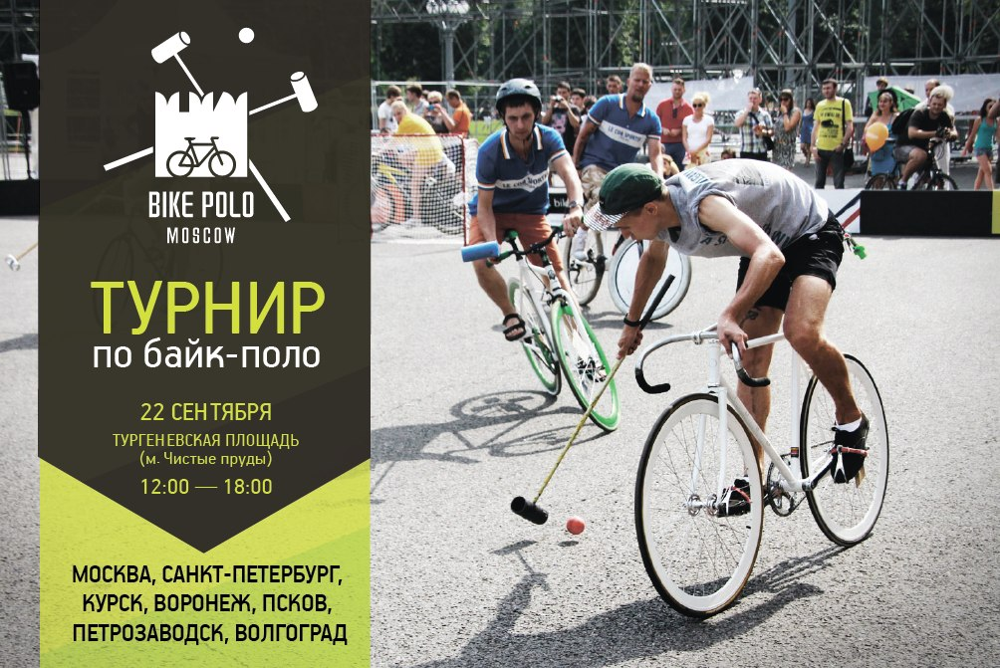
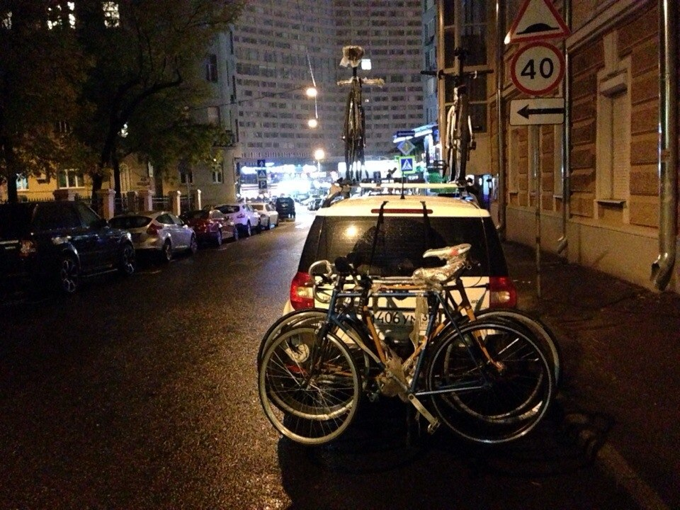
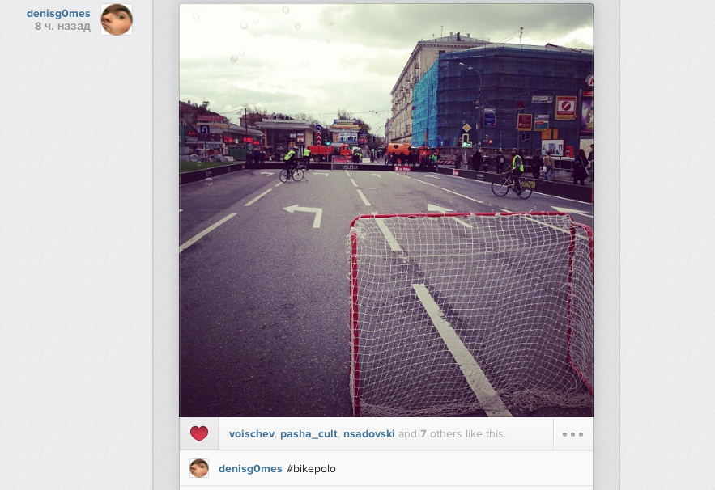
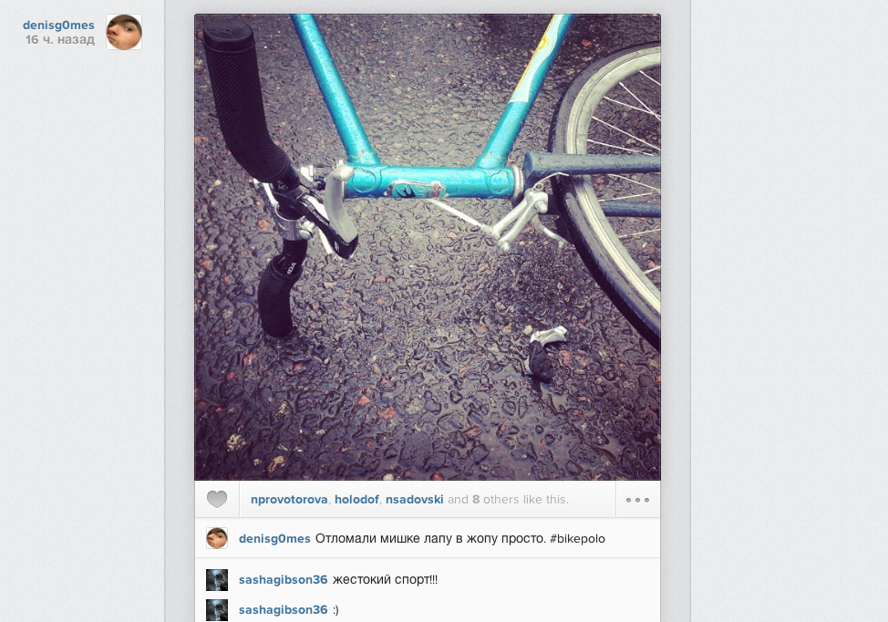
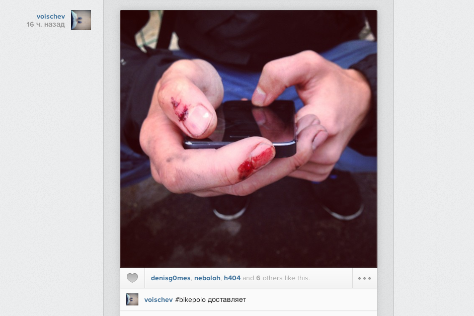
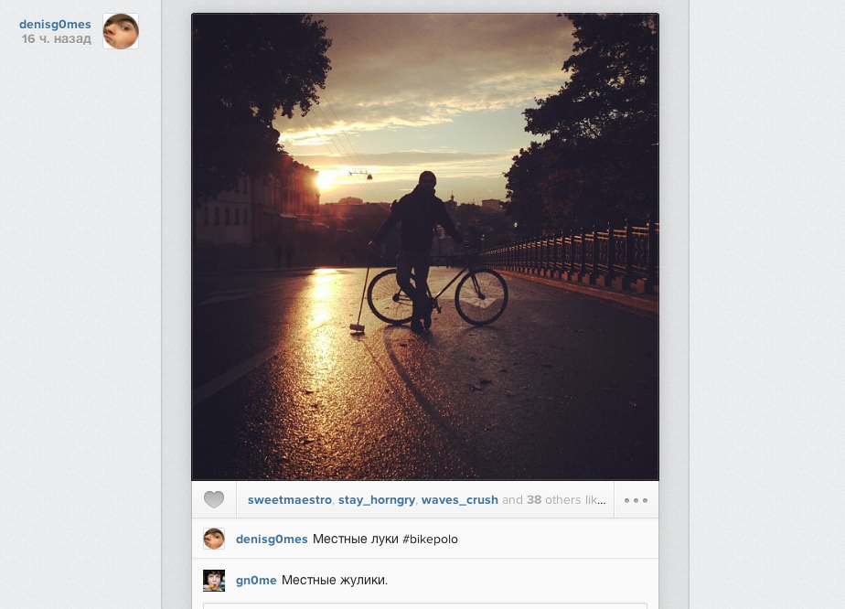
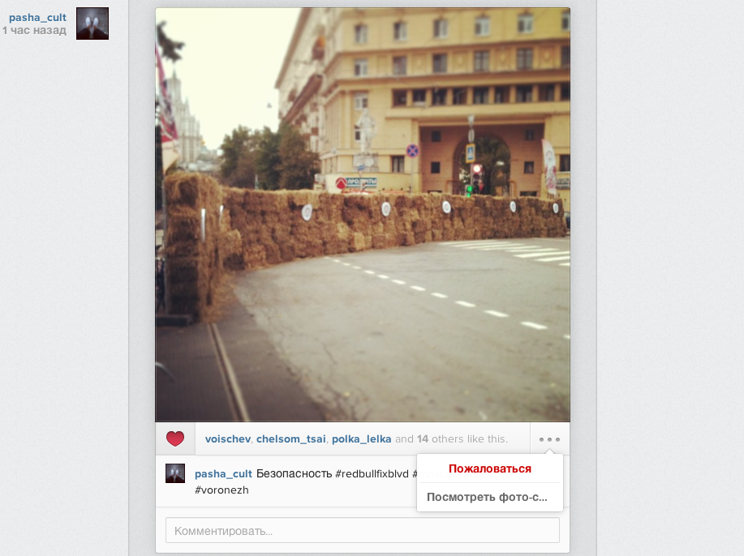
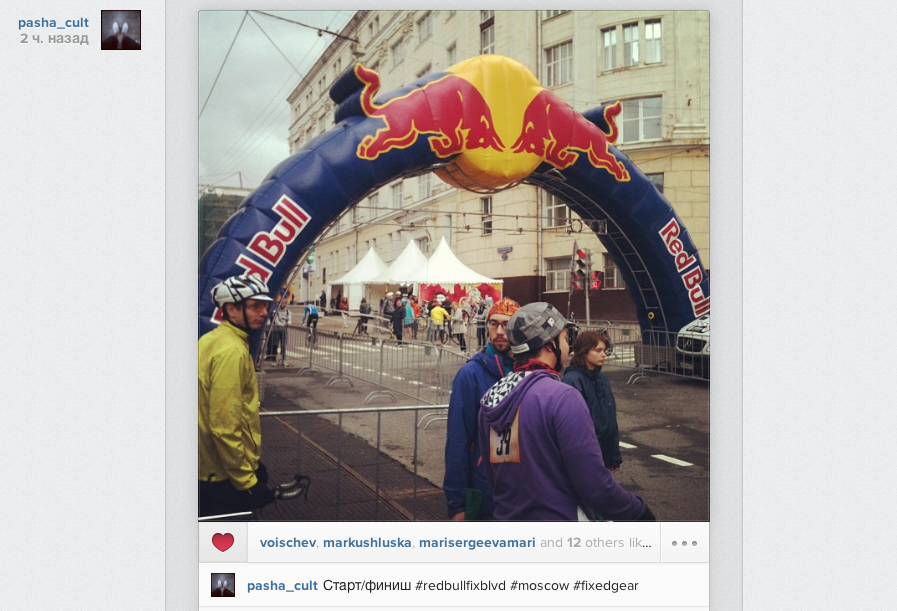

# Байк-поло

Немного о Байк-поло.

Мы участвовали на первом и втором турнире по байк-поло в Москве. И приняли участие в заезде Red Bull Fixed Gear

Нашу команду пригласили на чемпионат по Байк-поло. Старт из Воронежа

Приехали в Москву

Первые места мы не занимали.

Сломанные велосипеды

Сломанные тела

Было круто

Участвовали в заезде Red Bull Fixed Gear

## Заметки о Байк-поло

### Площадка
Борт высотой не меньше 100 см. Покрытие площадки ровное, твёрдое. Асфальт, бетон, чистая, без песка и др. мусора.
Углы площадки должны быть скруглены, или должны быть не ровны 90 градусам.

Разметка. Нужно нанести разметку в центре поля и у ворот.

Место штрафного. Обычно середина длинных бортов. Это место нужно как-то пометить.

### Ворота

Ворота. 183 на 93 см. Можно собрать из пластиковых водопроводных труб сетки и хомутов. Расстояние от борта не меньше 183 см.

### Мяч

Можно использовать мяч для игры в хоккей на траве

### Варианты для площадок

* Хоккейная коробка, нужно строить дополнительный борт
* Дворовая хоккейная коробка
* Соорудить

<iframe src="https://player.vimeo.com/video/72505419?color=f01000" width="640" height="360" frameborder="0" allow="autoplay; fullscreen" allowfullscreen></iframe>

### Судейство

* Турнирная таблица
* Два табло от 0 до 5

Регистрацию лучше проводить на месте. Перед составлением таблицы турнира. Таблицу турнира расписать сразу, до турнира. Методом жеребьёвки раздать командам номера. В play-off. выходят 4 команды.

Если круговая, то так:

| Номер тура | Игра 1 | Игра 2 | Игра 3 | Игра 4 | Игра 5 |
|------------|--------|--------|--------|--------|--------|
| 1 тур	| 1-10	| 2-9	| 3-8	| 4-7	| 5-6	|
| 2 тур	| 1-2	| 9-3	| 8-4	| 7-5	| 10-6	|
| 3 тур	| 3-1	| 2-10	| 4-9	| 5-8	| 6-7	|
| 4 тур	| 1-4	| 2-3	| 9-5	| 8-6	| 10-7	|
| 5 тур	| 5-1	| 4-2	| 3-10	| 6-9	| 7-8	|
| 6 тур	| 1-6	| 2-5	| 3-4	| 9-7	| 10-8	|
| 7 тур	| 7-1	| 6-2	| 5-3	| 4-10	| 8-9	|
| 8 тур	| 1-8	| 2-7	| 3-6	| 4-5	| 10-9	|
| 9 тур	| 9-1	| 8-2	| 7-3	| 6-4	| 5-10	|

### Оборудование / одежда

Видео на польском

<iframe width="560" height="315" src="https://www.youtube.com/embed/IjA9lK7aVMc" frameborder="0" allow="accelerometer; autoplay; encrypted-media; gyroscope; picture-in-picture" allowfullscreen></iframe>

## Ссылки

* [Правила лондонской ассоциации байк-поло](http://www.velo-kursk.ru/forum/viewtopic.php?f=53&t=3989)
* [Правила лондонской ассоциации байк-поло (Оригинал)](http://www.lhbpa.org/resources/LHBPA_Bike_Polo_Rules.pdf)
