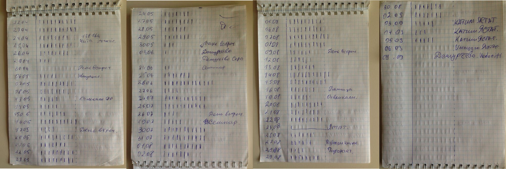

# Pomodoro

Я давно знаком с техникой Pomodoro. Она выручает меня, если нужно сосредоточиться и сделать много работы. Я решил попробовать использовать эту технику более серьёзно и сделать на её основе аналитику. С момента этого решения прошло уже более двух лет. Расскажу про свой опыт работы с техникой Pomodoro.

Есть мнение, что в большой компании программисты могут работать примерно 4 часа. Согласен с этим мнением, выяснил опытным путём. Встречи, переходы между локациями переговорок, рабочая почта, обед, поток информации в чатах, переключения между задачами, коллеги которые хотят тебя отвлечь, просто отъедают часы. От этого всего не возможно избавиться, нужно это принять. Моё единственное желание – оставшееся время работать максимально продуктивно. И что ещё более важнее, быть уверенным, что я отработал на максимум, не сомневаться в себе ни на каплю.

## Для тех кто хочет попробовать технику Pomodoro

У техники есть множество надстроек, каждый должен прийти к своему пониманию, что такое помидорка и как она будет работать на тебя. Для себя я понял, что моменты переключения когда я работаю, в основном работаю с редактором кода (сфокусирован на задаче), и время когда я думаю, или когда я могу себе позволить читать чатик, если понятно что делать.

### Базовая техника

1. Определяем задачу, которую нужно выполнить.
1. Устанавливаем таймер на 25 минут.
1. Работаем над задачей и избегаем любых отвлечений в эти 25 минут. Фокусируемся на задаче.
1. По окончании 25 минут берём 5-минутный перерыв, даже если задача до конца не решена. После перерыва заводим Pomodoro снова на 25 минут.
1. После четырёх 25-минутных рабочих отрезков, берём длительный перерыв в 15-30 минут.

Почему именно 25 минут? Такой промежуток времени:
* __достаточно короткий__, чтобы поддерживать дисциплину, противостоять отвлекающим воздействиям и не допускать «выгорание» от слишком долгой работы без отдыха, и
* __достаточно длинный__, чтобы получить реальное чувство прогресса в определённой задаче. Паузы по 5 минут помогают и мозгу отдохнуть, и переосмыслить то, что сделано за это время.

### Правила Pomodoro которые работают для меня

> Помидор неделим.

Если отвлёкся, или тебя отвлёк коллега помидор сбрасывается. Он не считается в статистике. Это мотивирует фокусироваться на задаче и не отвлекаться.

> Короткий перерыв для того, что бы продумать, что будешь делать следующие 25 минут.

Это очень важное для меня правило. Даже навык. Очень важно переключить мозг с режима «печатной машинки» в режим «думать». Часто в эти 5 минут решается больше, чем в 25 минут в режиме «печатной машинки». Думать лучше стоя, или расхаживая по офису.

> Долгий перерыв после 4 помидоров подряд.

Мозгу нужен отдых. Это подходящее время, для того что бы отвлечься, сходить на обед, переключиться, сменить деятельность.

### Просто 25/5

Когда вдруг навалилось дел, одолела прокрастинация, нужно сосредоточиться без какого либо дальнейшего анализа. Просто завожу помидорку на 25 минут и работаю стараясь не отвлекаться. 5 минут между помидорками. Когда много понятной работы, эти 5 минут я трачу на план действий на следующие 25 минут. Смысл в том, что бы переключать себя из режима печатной машинки (25 минут), в режим принятия решений (5 минут). Мозг будет больше перегружаться если думать во время механической работы. Когда мозг перегружен он не работает на максимум. Так я устаю быстрее. Вообще не читаю никакую почту, не отвлекаюсь, думаю – потом работу работаю. Отдых от работы, просмотр почты и все остальное делаю во время большого перерыва, после 4 помидорок.

В методичке про Pomodoro говориться про последние 5 минут помидорки в которые нужно анализировать что было сделано, но я их пока не чувствую, по этому использую 5 минут в перерыве.

Если такой ритм не получается поддержать скорее всего тип задач не очень подходит. Помидорки по 25 минут очень сложно использовать когда нужно думать больше условных 5 минут или анализировать что-то масштабное. Лучше просто не забывать устраивать себе перекур например 10 минут раз в час. После 25 минут я просто завожу следующие 25 минут сразу, без перерыва. В таких случаях есть мнение, что 50 минут много, оптимально 40-45 минут. Прямо как школьный урок.

На самом деле, если нужно много думать, или что-то исследовать – скорее всего уже ничего не горит, вам повезло, есть время поработать головой.

### Анализируем свой рабочий день с помощью Pomodoro

Когда простого поддержания рабочего ритма недостаточно и нужно понять – почему же я не укладываюсь по времени в мой первоначальный тайминг? Придётся потрудиться и начать записывать, что вообще происходит. В методичке есть достаточно понятные примеры как нужно производить анализ рабочего дня. 

На деле техника очень гибкая и не должна один в один быть отработана по методичке. Как мне кажется там достаточно много «около ритуального», что конечно в долгосрочной перспективе даёт больше информации для анализа.

Мне хочется легко и быстро. В выводах методички так и написано, что каждый должен подобрать свой ритм и систему анализа.

Я делаю примерно так:

В начале дня завожу первую разогревочную помидорку, нужно накидать план дня. Смотрю в календарь, там у меня отражаются все встречи, прикидываю примерное количество доступных помидорок. Не забываю про время на обед и первую помидорку. Записываю в блокнот дату и число доступных помидорок. В среднем у меня это 9 помидорок (те самые примерно 4 часа). Потом смотрю на дашборд с задачами, и начинаю делать критичные задачи.

В современных условиях работы, обычно уже есть план на каждого человека в команде. По этому мне не нужно выделять время на планирование задач на текущий день. После завершения помидорки ставлю «галочку», или «палочку» на против сегодняшней даты. К концу дня смотрю достиг ли я установленной цели в количестве помидорок. Если не достиг целевого значения записываю комментарий, что повлияло на мой результат. Если достиг, то смело и с хорошим настроением иду домой, хорошо поработал.

> Для большей мотивации если, хорошо поработал и достиг поставленной цели раньше, позволяю себе уйти домой, больше времени на отдых и переключение от работы.

Это самый простой способ анализа рабочего дня с техникой Pomodoro. Раньше я уделял время для анализа каждой отдельной задачей, составлял список работы на день. Сегодня такая детализация кажется излишней и я остановился на таком подходе.

Выводы сделаете сами. Мне помогло. Нравится, что инструмент простой и его можно подстроить под разные условия.

## Ссылки

* [Книга про технику Pomodoro](pomodoro.pdf). Прочитать можно всего за 4 помидорки.
* [Притча о том, как техника Pomodoro спасла заядлого трудоголика](https://habr.com/ru/company/smartprogress/blog/295274/)
* [Всё, что вам нужно знать о технике Pomodoro](https://lifehacker.ru/2015/05/28/all-about-pomodoro/)
* [Tomighty. Самый простое и бесплатное приложение](https://tomighty.github.io)
* [FocusList. Pomodoro с списком задач](http://focuslist.co)
* [Tomato One. Приложение под Mac OS](https://itunes.apple.com/us/app/tomato-one-free-focus-timer/id907364780)
* [Pomodoro для CLI](https://kevinschoon.github.io/pomo/)
* [Forestapp. Pomodoro с геймификацией](https://www.forestapp.cc/)
* [Телеграмм бот](http://telegram.me/pomodoro_timer_bot)
* [Pomotodo. Платный сервис с аналитикой](https://www.pomotodo.com)
* [Официальный сайт](https://francescocirillo.com/pages/pomodoro-technique)
* [Wikipedia](https://ru.wikipedia.org/wiki/Метод_помидора)
