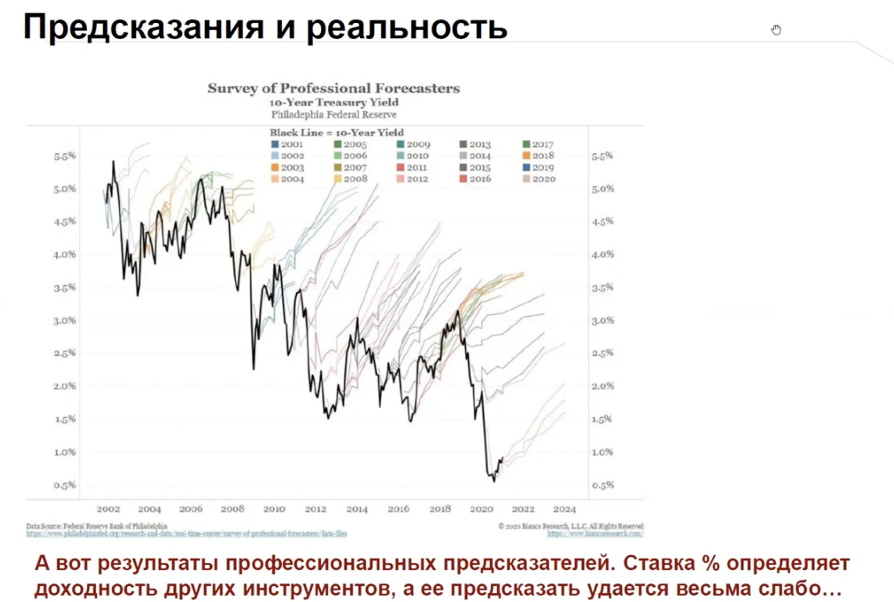
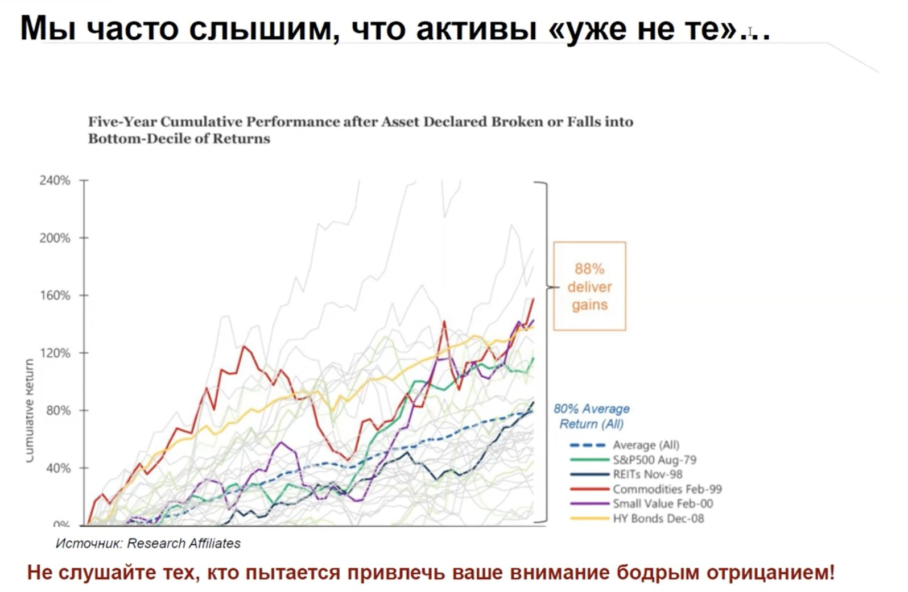
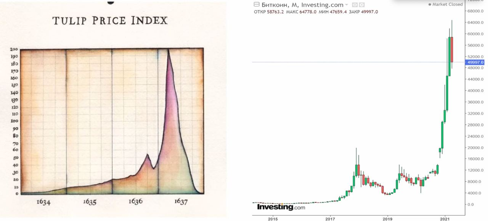
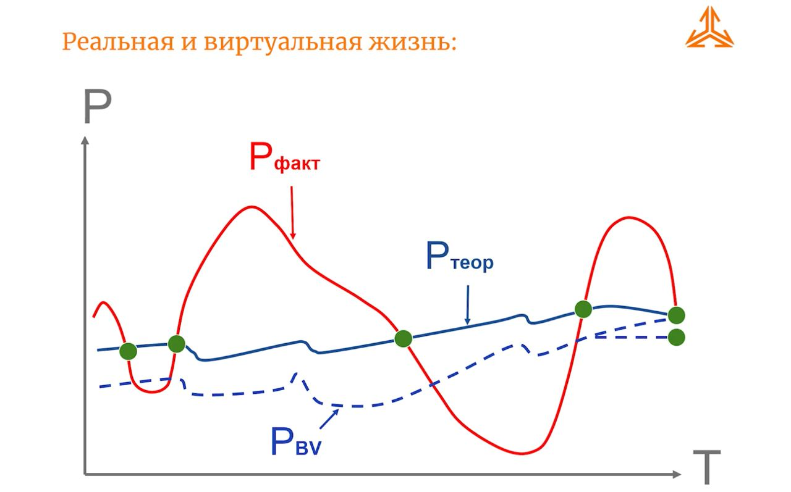

# Рынок ценных бумаг

В этой заметке собираю крайние случаи на фондовом рынке объясняющие иррациональность рынка ценных бумаг.

## Предсказания на фондовом рынке

Предсказания даже самых лучших людей на фондовом рынке не работают. На примере ежегодного опроса ФЕДа о доходности 10 летних трежерис.

88% предсказаний что "всё, каюк" не сработали. И принесли бы 80% доходности в первые 5 лет.

## Тюльпаномания, или музыкальный стул

Ситуация с Bitcoin очень напоминает [график стоимости луковиц тюльпанов в Нидерландах 1637 году](https://ru.wikipedia.org/wiki/Тюльпаномания). Фундаментально, ни луковица тюльпана, ни Bitcoin не стоят запрашиваемых денег. Спрос рождает предложение.

## Теория эффективного рынка

Рынок эффективен — в цену закладывается возможный риск и премия.
Пример эффективности: образование цена на облигации.

Рынок не эффективен — в большинстве точек на графике операторы рынка ошибаются с оценкой внешних факторов на бизнес.
Пример неэффективности: 14 из 15 дней роста будут компенсированы днями падений.

Думаю что всё-таки рынок не рационален и даёт нам возможности найти эти отклонения.

[Видео лекции от УК Арсагера](https://www.youtube.com/watch?v=dzl3uv0USEo)

