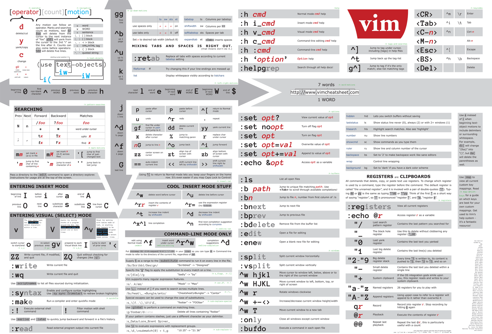

# Vim

Заметка про VIM




## Форматирование:

Для не отформатированных файлов

```
:!js-beautify % -o %
```

Использование prettier

```
nnoremap <C-f> :silent exec "!npx prettier % --write --trailing-comma=all --single-quote=true --print-width=100"<cr> :redraw!<cr>
```

## Буферы
Fuzzy поиск по именам файлов (в открытых буферах).

```
:b fuzzy
```

Настраиваем горячу клавишу, например <Leader>f:

```
nnoremap <Leader>f :set nomore<Bar>:ls<Bar>:set more<CR>:b<Space>
```

## Git

Вызвать git-blame для выделенной, в VISUAL MODE, части текста

```
vnoremap <Leader>b :<C-U>!git blame <C-R>=expand("%:p") <CR> \| sed -n <C-R>=line("'<") <CR>,<C-R>=line("'>") <CR>p <CR>
```

## Опции VIM

При открытии файла установить курсор в последней позиции

```
au BufReadPost * if line("'\"") > 0|if line("'\"") <= line("$")|exe("norm '\"")|else|exe "norm $"|endif|endif
```

Автоматически удалять висячие пробелы при сохранении

```
autocmd BufWritePre *.{bemhtml,bemtree,js,c,css} :%s/\s\+$//e
```

Центровать результат поиска всегда по центру

```
nnoremap n nzz
nnoremap N Nzz
nnoremap * *zz
nnoremap # #zz
nnoremap g* g*zz
nnoremap g# g#zz
```

Загрузить предыдущую сессию

```
set viminfo='10,\"100,:20,%,n~/.viminfo
```


Поставить курсор на предыдущую позицию открывая файл

```
au BufReadPost * if line("'\"") > 0|if line("'\"") <= line("$")|exe("norm '\"")|else|exe "norm $"|endif|endif
```

Изменять директорию до места где находится редактируемый файл

```
autocmd BufEnter * lcd %:p:h
```

## Работа с файлами

Открыть файл под курсором
```
gf
```

Открыть файл под курсором в отдельном сплите

```
CTRL-w+f
```

## Поиск

Найти слово над которым курсор
```
*
```

Поиск по файлам

```
:grep PATERN [PATH] | :copen
```

Открыть список с результатами поиска по файлам

```
:copen
:cw
```

## Go to Definition

Перейти к определению.

`gd` — перейти к определению в файле

Пользуюсь `ctags` с [настройками](https://github.com/voischev/dotfiles/blob/master/ctags) для `typescript`.
Тут можно подсмотреть настройки для [TypeScript](https://github.com/jb55/typescript-ctags) и [JavaScript](https://github.com/romainl/ctags-patterns-for-javascript).

В проекте строим файл `tags`.

```
ctags -R .
```

После чего можно будет использовать команды:

* `CTRL+]` — Перейти к определению
* `CTRL+t` — Вернуться обратно к месту вызова
* `g+CTRL+]` — Список определений
* `:tag React+TAB` — Круговой поиск определений начинающихся с `React`
* `:tag React+CTRL+d` Полный список определений начинающихся с `React`


## Текст

Записать выделенный текст в файл

```
:'<,'>w text.txt
```

Перейти к последнему выделенному фрагменту текста

```
gv
```

Выравнивание текста

```
:center [width]
:right [width]
:left
```

Таблица с символами

```
:help digraph-table
```

В режиме редактирования через CTRL+k

```
«   <<
»   >>
—   M-
©   Co
®   Rg
±   +-
λ   l*
π   p*
δ   d*
```

## Функции

В режиме редактирования активируем калькулятор CTRL+r+= вводим выражение, жмём Enter

```
CTRL+r+=512/2 Enter
256
```

Сортировка по длине строк

```
:'<,'> ! awk '{ print length(), $0 | "sort -n | cut -d\\ -f2-" }'
```

## Синтаксис

Открыть файл без расширения с нужным синтаксисом. Добавить в конец файла комментарий

```
# vim: syntax=config
```

## Ссылки

* [danielmiessler.com/study/vim/](https://danielmiessler.com/study/vim/)
* [mathiasbynens/dotfiles](https://github.com/mathiasbynens/dotfiles)
* [mpyatishev](https://github.com/mpyatishev)
* [mislav/vimfiles](https://github.com/mislav/vimfiles/blob/master/vimrc)
* [gmarik/vimfiles](https://github.com/gmarik/vimfiles)
* [swaroopch/dotvim](https://github.com/swaroopch/dotvim/blob/master/vimrc)
* [madundead/stuff/dotfiles](https://github.com/madundead/stuff/blob/master/dotfiles/vim/vimrc.symlink)
